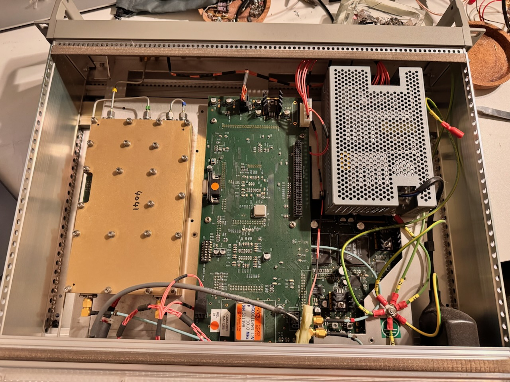
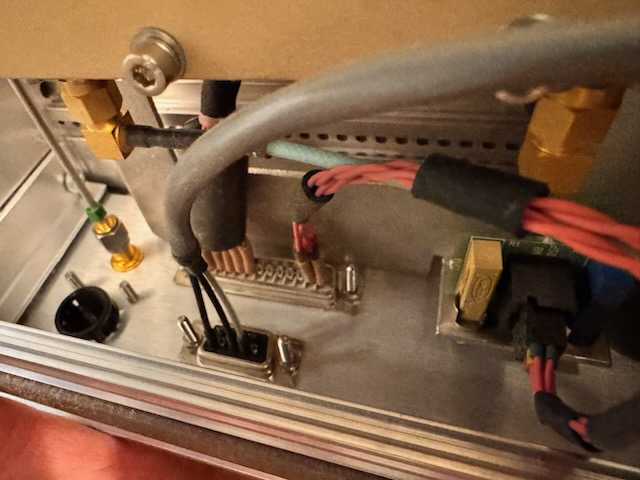
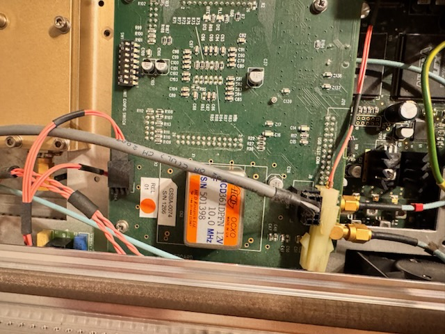
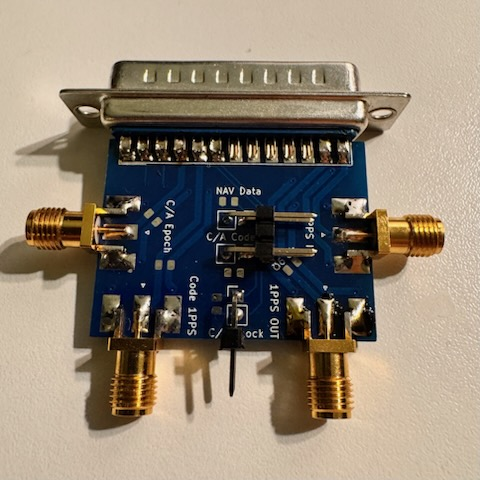

# Spirent GSS6100
Control programs and resources for the Spirent GSS6100 L1 GPS simulator device of one space vehicle.

## What you can do

With Spirent GSS6100 you can generate the signal of one GPS Satellite. You can test your GPS receiver front end sensitity by changing the signal level or measure the signal hardware delay.

## Internals

DSUB connectors

10MHz OCXO

Custom DSUB adapter to SMA

